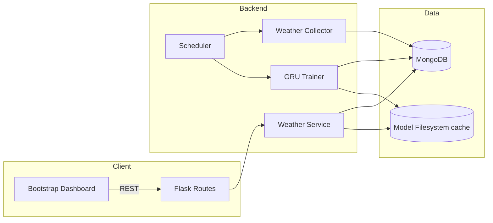
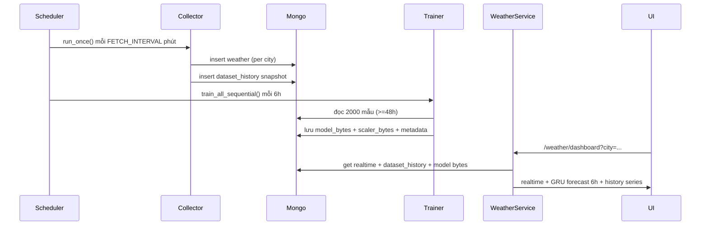

<div align="center">
  <h1>AgriCast AI</h1>
  <p><strong>48h Weather Intelligence • GRU Forecast • MongoDB Pipeline • Bootstrap Dashboard</strong></p>
</div>

## 1. Tổng quan
- Thu thập dữ liệu thời tiết 48 giờ (≈2000 mẫu) từ WeatherAPI.
- Lưu realtime vào MongoDB (`weather`), snapshot dataset vào `dataset_history`.
- Trainer GRU nhiều tầng + MinMaxScaler: cửa sổ vào 48 bước ⇒ dự báo 6 bước.
- Scheduler fetch mỗi `FETCH_INTERVAL` phút (mặc định 10) và tự train mỗi 6 giờ.
- API Flask chuẩn REST (Marshmallow + response format thống nhất).
- Dashboard Bootstrap 5 hiển thị realtime, forecast (Chart.js), danh sách tỉnh, dataset history.

## 2. Kiến trúc hệ thống


## 3. Pipeline Fetch → Train → Predict


## 4. Thư mục chính
```
backend/
  app.py                 # Flask factory + scheduler bootstrap
  jobs/scheduler.py      # APScheduler cấu hình
  collector/fetch_weather.py
  trainer/train_gru.py
  services/weather_service.py
  schemas/weather_schemas.py
  routes/*.py            # weather/auth/user/irrigation
  utils/responses.py
frontend/
  src/pages/weather-gru.html # Dashboard mới
  src/styles/main.css
```

## 5. API chính
| Endpoint | Method | Mô tả |
| --- | --- | --- |
| `/api/weather/cities` | GET | Danh sách tỉnh khả dụng |
| `/api/weather` | GET | Lấy realtime từ WeatherAPI (direct) |
| `/api/weather/realtime` | GET | Realtime từ Mongo (city) |
| `/api/weather/predict` | GET | GRU 48→6 forecast |
| `/api/weather/datasets` | GET | Lịch sử dataset snapshots |
| `/api/weather/dashboard` | GET | Tổng hợp realtime + forecast + history |
| `/api/weather/fetch-now` | POST | Trigger collector ngay |
| `/api/weather/train-now` | POST | Train toàn bộ (song song) |
| `/api/weather/train-city` | POST | Train riêng 1 tỉnh |
| `/api/weather/train-all[-parallel]` | POST | Train batch tuần tự/parallel |
| `/api/weather/model-info` | GET | Thông tin model/scaler 1 tỉnh |
| `/api/weather/model-check` | GET | Kiểm tra tồn tại model |

Tất cả response theo format:
```json
{
  "status": "success",
  "message": "ok",
  "data": { ... }
}
```

## 6. Dataset & Model Policy
- `weather`: lưu realtime, trường `timestamp` (Asia/Bangkok) + `timestamp_utc`.
- `dataset_history`: snapshot per city (samples, coverage_hours, latest_timestamp).
- `models`: lưu `model_bytes`, `scaler_bytes`, metadata (`samples_used`, `coverage_hours`, `seq_in`, `seq_out`, `features`).
- Điều kiện train: ≥2000 samples & ≥48h coverage. Nếu thiếu → skip để đảm bảo đúng tiểu luận.

## 7. Scheduler Jobs
| Job | Lịch | Chức năng |
| --- | --- | --- |
| `fetch-weather` | mỗi `FETCH_INTERVAL` phút (env) | Gọi WeatherAPI → Mongo → dataset_history |
| `periodic-train` | mỗi 6h (cron) | Train toàn bộ tỉnh sequential |

Có thể tắt scheduler bằng env `DISABLE_SCHEDULER=true` (dùng khi chạy worker riêng).

## 8. Hướng dẫn chạy
### Backend
```bash
cd backend
python -m venv .venv && .venv\Scripts\activate  # Windows
pip install -r requirements.txt
set MONGO_URI=mongodb://localhost:27017
set WEATHERAPI_KEY=...
python -m backend.app
```

### Frontend (static)
```bash
cd frontend/src
python -m http.server 8080
# truy cập http://localhost:8080/pages/weather-gru.html
```
python -m backend.app


> Gợi ý: triển khai backend lên Render/Fly hoặc Cloud Run và cấu hình `window.API_BASE` trong frontend nếu domain khác.

## 9. UI Dashboard
- **Realtime panel**: card hiển thị nhiệt độ/độ ẩm/áp suất/gió/mây/mưa với timestamp cập nhật.
- **Forecast panel**: Chart.js hiển thị 6 bước tiếp theo (temp) + overlay humidity/rain history, kèm danh sách forecast.
- **KPI cards**: highlight 3 chỉ số chính.
- **Province list**: button chips chọn tỉnh, đồng bộ dropdown.
- **Dataset history**: bảng snapshot coverage, samples, latest record.
- **Actions**: nút "Lấy dữ liệu mới" (trigger collector) và "Huấn luyện lại".

## 10. Validation & An toàn
- Marshmallow schemas: `CityQuerySchema`, `DatasetHistoryQuerySchema`, `TrainAllQuerySchema`.
- `utils/responses.ApiError` + `success_response`/`error_response` đảm bảo payload thống nhất.
- Các route background (fetch/train) chạy async thread để không block request.

## 11. Checklist tính năng (đáp ứng tiểu luận)
- [x] Thu thập 48h/2000 mẫu → dataset_history theo dõi coverage.
- [x] GRU nhiều tầng, chuẩn hóa MinMax.
- [x] Train lại mỗi 6 giờ (scheduler).
- [x] Mongo collections: `weather`, `models`, `dataset_history`.
- [x] API sạch + validation + error-handling.
- [x] Dashboard: realtime + forecast + biểu đồ (temp/humidity/rain) + danh sách tỉnh + dataset history.

## 12. Thiếu sót / Hướng phát triển
- Chưa thêm test automation cho trainer/service.
- Chưa có auth cho dashboard (API public).
- Chưa tích hợp metrics/alerts khi scheduler lỗi.

## 13. Tham khảo nhanh
- `.env` sample: copy từ `backend/.env` (không commit) để cấu hình keys.
- Scripts hỗ trợ: `backend/bootstrap_collect.py` dùng bơm dữ liệu đạt target 2000 mẫu nhanh.

Chúc bạn sử dụng AgriCast AI hiệu quả! Nếu cần mở rộng thêm (như MQTT, IoT sensor thực tế, CI/CD) hãy tiếp tục phát triển trên kiến trúc hiện tại.